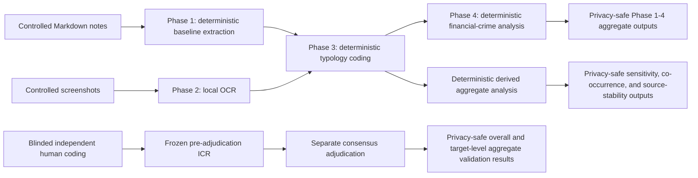

# Analysis Pipeline

## Boundary

Complete controlled inputs and record-level outputs remain outside GitHub. Derived analysis reads controlled Phase 3 rows and writes only grouped outputs. The public exporter permits only named aggregate files. No Phase 3b, Phase 4b, Phase 5, or LLM-assisted empirical pathway is included.
